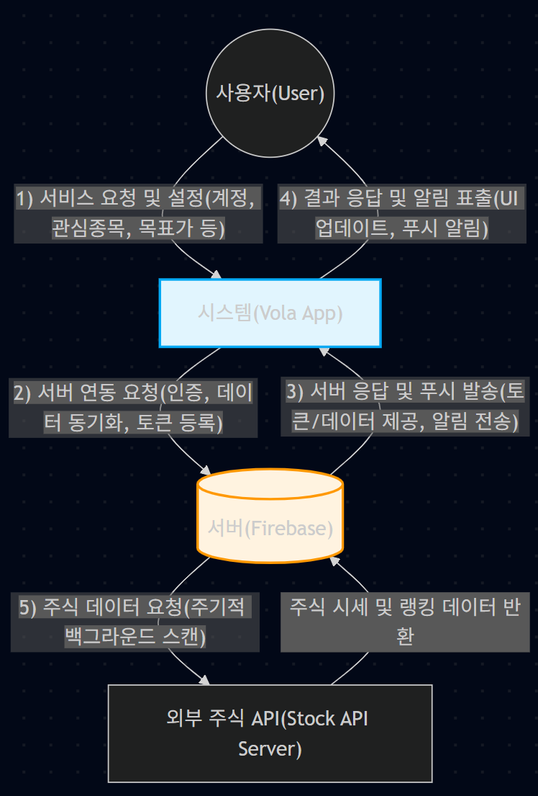

# 1. Conceptualization

**주식 변동성 및 목표가 알림 애플리케이션 'Vola'**

### [ Revision history ]

| Revision date | Version # | Description | Author |
| :--- | :--- | :--- | :--- |
| 2026-03-23 | 1.00 | Conceptualization 문서 초안 작성 | 윤창길 |

### = Contents =
1. Business purpose
2. System context diagram
3. Use case list
4. Concept of operation
5. Problem statement
6. Glossary
7. References

---

## 1. Business purpose

**Project background & motivation**

주식 시장은 국가를 가리지 않고 높은 변동성을 보이며, 성공적인 투자를 위해서는 정확한 매수 및 매도 타이밍을 포착하는 것이 필수적이다. 그러나 대부분의 개인 투자자들은 본업이나 학업 등의 이유로 장시간동안 주식 차트를 모니터링하는 데 현실적인 한계가 있으며, 이는 투자 기회 상실과 심리적 불안감으로 이어진다. 또한 기존 증권사 앱에서 사용자가 원하는 관심 종목의 특정 타이밍만을 직관적으로 관리하기 어렵다. 본 프로젝트는 이러한 불편함을 해결하고자 사용자 맞춤형 주식 알림 애플리케이션(이하 Vola)을 제작하기로 하였다.

Vola는 관심 종목의 목표 주가를 개별적으로 지정하여 목표 주가에 도달하면 알림을 발송하여 사용자가 불필요하게 주식 차트를 모니터링하지 않아도 되도록하고 목표 주가에 대한 유효 기간을 설정하여 사용자의 의도에 벗어난 알림이 발송하지 않도록 방지한다. 또한 사용자의 관심 영역 밖에서 발생하는 새로운 투자 기회를 놓치지 않도록 하기 위해 한국, 미국의 전체 시장에서 사용자가 직접 지정한 당일 변동률을 초과하는 종목을 포착하여 즉각적으로 알려줌으로써, 바쁜 일상 속에서도 장시간 차트에 얽메이지 않고 원하는 시장의 핵심 흐름을 파악하여 효율적인 투자 결정을 내릴 수 있도록 최적의 투자 환경을 제공하는 것을 본 프로젝트의 핵심 동기로 삼는다.

**Goal**

Firebase를 활용한 사용자 인증(회원가입/로그인/비밀번호 찾기) 및 데이터 관리 서버 구축, 관심 종목 맞춤별 목표 주가 알림 기능 구현 및 관심 종목에 대해 목표 주가를 지정하지 않아도 특정 범위 내의 변동성이 발생하면 알림(상승 & 하락)을 제공한다. 이를 통해 투자자가 차트를 계속 모니터링하지 않아도, 계획한 매수/매도 타이밍을 놓치지 않게 돕는 어시스턴스 환경 조성을 목표로 한다.

**Target market**

업무나 학업 등의 본업으로 인해 실시간 주식 모니터링이 불가능한 직장인 및 학생 투자자, 감정에 휘둘리지 않고 본인이 설정한 목표 주가(매수/매도 타점)에서만 기계적으로 거래하고자 하는 투자자를 타겟으로 한다.

---

## 2. System context diagram

**1) User -> System (사용자 -> 시스템)**
* Request Register / Login / Logout (회원가입, 로그인, 로그아웃 요청)
* Request Find Password (비밀번호 찾기 요청)
* Request View Watchlist (관심 종목 조회 요청)
* Request Add / Delete Watchlist (관심 종목 추가/삭제 요청)
* Request Set Target Price & Duration (목표 주가 및 유지 시간 설정 요청)
* Request Manage Target Price List (목표 주가 리스트 확인/수정/삭제 요청)
* Request Set Market Volatility Threshold (국가별 및 관심 종목 변동성 기준값 설정 요청)

**2) System -> Server (시스템 -> 서버)**
* Request User Authentication (사용자 인증 및 검증 요청)
* Request Send Password Reset Email (비밀번호 재설정 이메일 발송 요청)
* Request Save / Load User Data (관심 종목, 목표 주가, 변동성 설정값 동기화 요청)
* Request Real-time Stock Data & Ranking (관심 종목 현재가 및 전체 시장 등락률 랭킹 데이터 요청)
* Register Device Token for Push Notification (푸시 알림 수신용 디바이스 토큰 등록)

**3) Server -> System (서버 -> 시스템)**
* Confirm Authentication & Issue Token (인증 확인 및 세션/토큰 발급)
* Confirm Email Sent (비밀번호 재설정 이메일 발송 완료 응답)
* Provide Synchronized User Data (저장된 사용자 설정 데이터 제공)
* Provide Real-time Stock Data & Ranking (실시간 주식 시세 및 급등주 랭킹 데이터 제공)
* Push Target Price / Volatility / Surge Alerts (목표 주가, 변동성, 급등주 달성 푸시 알림 전송)

**4) System -> User (시스템 -> 사용자)**
* Confirm Register / Login / Logout (회원가입, 로그인, 로그아웃 완료 응답)
* Confirm Password Reset Request (비밀번호 찾기 요청 완료 안내)
* Show Watchlist & Stock Data (메인 화면에 관심 종목 및 주가 데이터 출력)
* Confirm Settings Update (관심 종목, 목표가, 변동성 설정 완료 안내)
* Display Target Price Alert (목표 주가 도달 푸시 알림 표출)
* Display Watchlist Volatility Alert (관심 종목 변동성 푸시 알림 표출)
* Display Market Surge Alert (전체 시장 급등주 포착 푸시 알림 표출)

**5) Server -> Stock API Server (서버 -> 외부 주식 API)**
* Request Real-time Stock Data & Ranking (주식 시세 데이터 요청 및 반환)

---

## 3. Use case list

| No. | Use Case | Actor | Description |
|---|---|---|---|
| 1 | **Register** | User | 사용자가 회원가입이 되어있지 않을 경우, 이메일 등의 정보를 입력하여 계정을 생성한다. |
| 2 | **Login** | User | 사용자가 본인의 계정 정보로 로그인하여 서비스를 이용한다. |
| 3 | **Logout** | User | 사용자가 본인의 계정을 로그아웃한다. |
| 4 | **Find Password** | User | 사용자가 비밀번호를 잊은 경우, 가입된 이메일 인증을 통해 비밀번호를 재설정한다. |
| 5 | **View Watchlist** | User | 사용자가 앱 메인 화면에서 본인이 등록한 관심 종목들의 현재 주가와 변동 추이를 확인한다. |
| 6 | **Manage Watchlist** | User | 사용자가 새로운 종목을 관심 종목으로 추가하거나, 기존 종목을 리스트에서 삭제한다. |
| 7 | **Set Target Price** | User | 사용자가 현재 보고있는 주식의 그래프에서 24시간 동안 유효한 목표 주가를 설정한다. |
| 8 | **Manage Target Price List** | User | 사용자가 설정한 모든 목표 주가를 확인하고, 목표 주가의 지속 시간을 설정하거나 삭제할 수 있다. |
| 9 | **Set Market Volatility Threshold** | User | 사용자가 관심 종목 및 국가별(한국,미국) 전체 시장 스캐닝을 위한 당일 변동률(%)의 기준값을 개별적으로 설정한다. |
| 10 | **Send Target Price Alert** | Server | 시스템이 관심 종목의 주가를 감시하다가, 사용자가 설정한 목표 주가에 도달하면 푸시 알림을 발송한다. |
| 11 | **Send Watchlist Volatility Alert** | Server | 시스템이 관심 종목 내에서 지정한 범위 이상의 큰 등락이 발생할 경우 푸시 알림을 발송한다. |
| 12 | **Send Market Surge Alert** | Server | 시스템이 백그라운드에서 시장 전체를 스캔하여, 지정한 범위 이상의 변동률을 초과하는 변동성이 발생하면 푸시 알림을 발송한다. |
| 13 | **Authentication** | Server | 사용자의 회원가입 및 로그인 요청 시, 입력된 이메일과 비밀번호를 검증하고 정상적인 사용자일 경우 인증 토큰(세션)을 발급한다. |
| 14 | **Send Password Reset Email** | Server | 사용자가 비밀번호 찾기를 요청하면, 가입된 이메일 주소의 유효성을 확인한 뒤 비밀번호 재설정 링크가 포함된 이메일을 발송한다. |
| 15 | **Synchronize User Data** | Server | 사용자가 설정한 관심 종목, 목표 주가, 변동성 기준값 등의 개인 데이터를 DB에 저장하고 최신 상태로 동기화한다. |
| 16 | **Provide Stock Market Data** | Server(API) | Firebase 서버의 주기적인 요청에 따라 실시간 주가 데이터와 시장 등락률 랭킹 데이터를 수집하여 반환한다. |

---

## 4. Concept of operation

| Use Case | Purpose | Approach | Dynamics | Goals |
|---|---|---|---|---|
| **Register** | 앱 서비스를 이용하기 위해 계정을 시스템에 등록 | 로그인 화면에서 '회원가입' 버튼 클릭 | 앱 최초 사용 및 새 계정 생성 시 | Firebase 연동 이메일/비밀번호 기반 회원가입 구현 |
| **Login** | 저장된 사용자 데이터를 불러와 서비스를 이용 | 이메일/비밀번호 입력 후 '로그인' 버튼 클릭 | 로그아웃 상태에서 앱 접속 시 | 사용자 인증 수행 및 메인 화면 전환 구현 |
| **Logout** | 기기 내 사용자 계정 접속 해제 및 세션 종료 | 설정 화면에서 '로그아웃' 버튼 클릭 | 계정 전환 및 완전한 서비스 종료 시 | 인증 토큰 폐기 및 로그인 화면 전환 구현 |
| **Find Password** | 비밀번호 분실 시 계정 접근 권한 복구 | '비밀번호 찾기'에서 가입 이메일 입력 | 비밀번호 오류로 재설정이 필요한 경우 | 이메일을 통한 비밀번호 재설정 링크 발송 구현 |
| **View WatchList** | 관심 종목들의 현재 주가 및 등락 파악 | 로그인 성공 시 앱 메인 화면 진입 | 실시간 주가 변동 현황 확인 시 | API 데이터를 받아와 리스트 형태로 출력 구현 |
| **Manage WatchList** | 모니터링할 관심 종목 구성을 최신화 | '종목 검색/추가' 또는 '삭제' 버튼 클릭 | 종목 모니터링 추가/해제 필요 시 | 종목 검색/추가/삭제 및 서버 DB 동기화 구현 |
| **Set Target Price** | 원하는 매수/매도 타이밍 도달 시 알림 수신 | 상세 차트 화면에서 '목표가 알림' 금액 설정 | 계획된 주가에서 기계적 투자를 원할 경우 | 24시간 유지되는 목표가 설정 및 활성화 구현 |
| **Manage Target Price List** | 활성화된 목표가 현황 파악 및 시간 조절 | 앱 내 '알림 관리' 메뉴 진입 | 목표가 수정/삭제 및 알림 시간 확인/변경 시 | 전체 설정 목록 조회 및 개별 설정 변경 기능 구현 |
| **Set Market Volatility Threshold** | 변동성 및 급등주 포착을 위한 기준값 설정 | '변동성 설정'에서 슬라이더 조절 | 알림 민감도 조정 및 피로도 제어 시 | 당일 변동률(%) 기준값 저장 및 적용 로직 구현 |
| **Receive System Alerts** | 조건 충족 종목을 사용자에게 즉각 인지 | 서버가 설정값 충족 판별 시 앱으로 푸시 전송 | 앱 백그라운드 상태에서 조건 달성 시 | 스마트폰 푸시 알림 표출 및 중복 방지 수신 로직 구현 |

---

## 5. Problem statement

본 프로젝트를 수행함에 있어 고려해야 할 기술적 어려움 및 비기능적 요구사항은 다음과 같다.

**Technical Difficulties**
* **API 호출 제한:** 외부 증권사 API의 제한된 요청 수로 인해, 앱이 직접 데이터를 요청할 경우 유저 수에 비례하여 트래픽이 기하급수적으로 증가하므로, 중앙 서버가 데이터를 일괄 수집하고 분배하는 구조로 설계하여 해결해야 한다.

**Non-Functional Requirements (NFRs)**
* **Performance (성능):** 주식 시장의 실시간성을 고려하여, 목표가 도달 시점부터 사용자 기기에 푸시 알림이 도달하기까지의 지연 시간을 최소화해야 한다.
* **Reliability (신뢰성):** 백그라운드 감시 서버는 장 운영 시간 동안 예기치 않은 종료 없이 무중단으로 동작해야 한다.
* **Security (보안):** Firebase Authentication을 통해 사용자 개인정보를 보호하고, 증권사 API 통신에 사용되는 App Key 및 Secret Key는 서버의 환경변수로 철저히 은닉하여 외부 노출을 방지해야 한다.

---

## 6. Glossary

* **Vola:** 본 프로젝트에서 개발하는 주식 변동성 및 목표가 알림 애플리케이션의 명칭.
* **FCM (Firebase Cloud Messaging):** 서버(Firebase)에서 사용자의 스마트폰 앱으로 푸시 알림 데이터를 전송하기 위해 사용하는 구글의 무료 메시징 서비스.
* **Threshold (임계값):** 사용자가 사전에 지정한 주가 변동성 기준 퍼센트(%). 당일 주가의 등락률이 이 값을 초과할 때 알림이 발생한다.
* **Watchlist (관심 종목):** 사용자가 주가 변동이나 알림을 받기 위해 등록해 둔 특정 주식 종목들의 목록.
* **Stock API:** 실시간 주가 시세, 등락률, 전체 시장 랭킹 등의 원본 데이터를 제공받기 위해 통신하는 증권사(예: 한국투자증권)의 외부 서버 인터페이스.

---

## 7. References

* Google Firebase Documentation (Authentication, Cloud Functions, Firestore, FCM)
* 한국투자증권(Korea Investment & Securities) KIS Developers Open API 공식 문서
* IEEE Std 830-1998, IEEE Recommended Practice for Software Requirements Specifications
