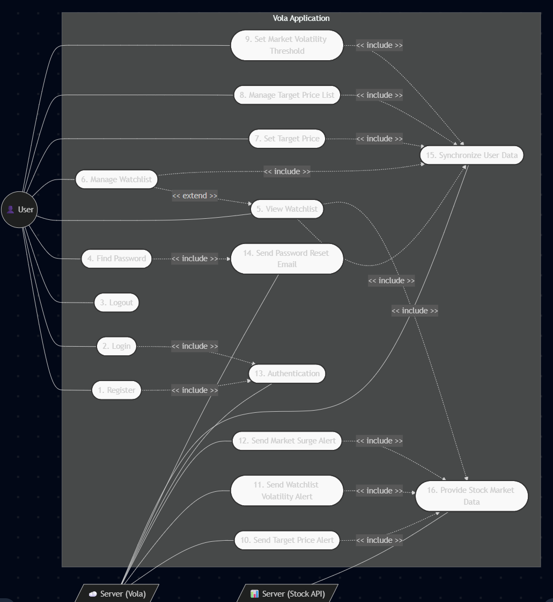
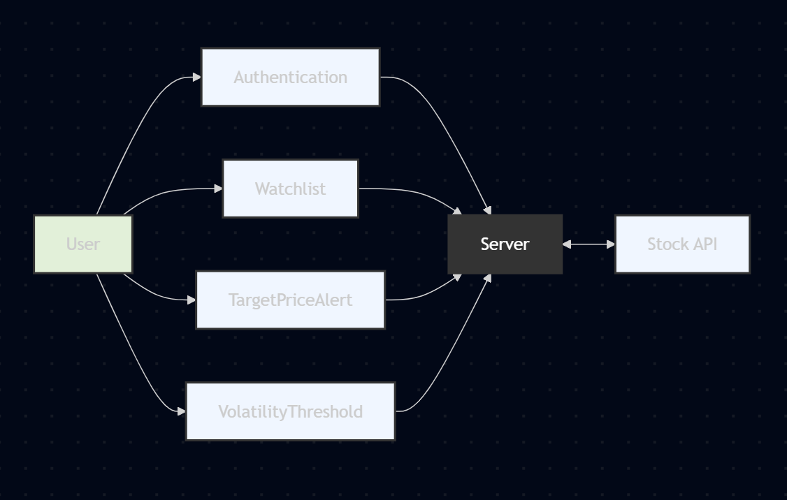
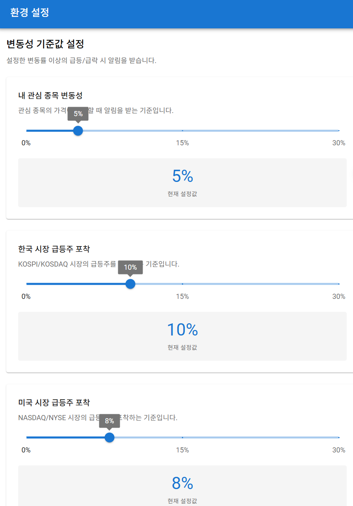
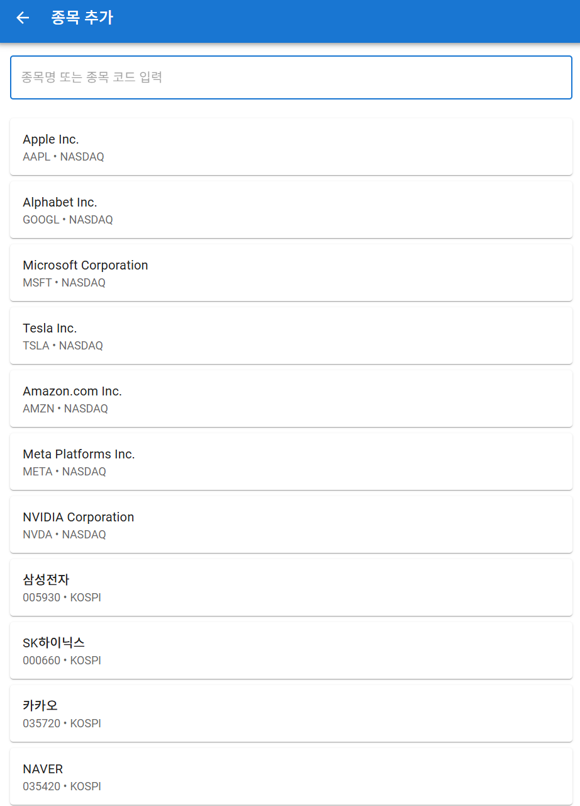
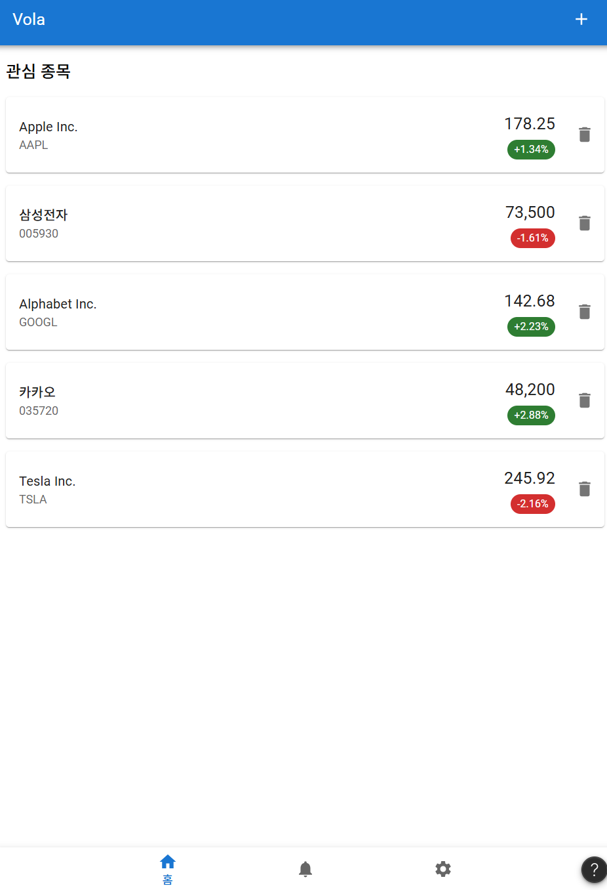
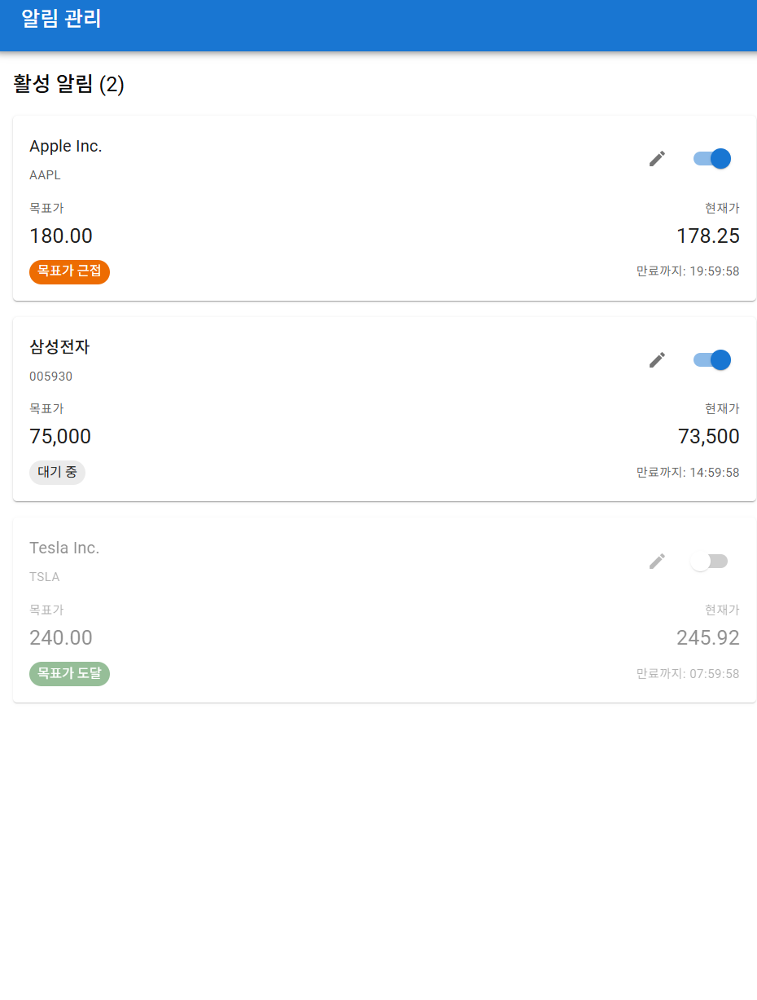

# 2. Analysis

**주식 변동성 및 목표가 알림 애플리케이션 'Vola'**

### [ Revision history ]

| Revision date | Version # | Description | Author |
| :--- | :--- | :--- | :--- |
| 2026-05-06 | 1.00 | Analysis 문서 초안 작성 | 윤창길 |

## ==== Contents ====

#### 1. Introduction 
#### 2. Use case analysis
#### 3. Domain analysis
#### 4. User Interface prototype
#### 5. Glossary 
#### 6. References 

---

## 1. Introduction

본 문서는 Conceptualization 단계의 문서에 이어지는 Analysis 단계의 문서이다.

### 1) Summary
주식 시장의 높은 변동성 속에서 성공적인 투자를 하려면 정확한 매수 및 매도 타이밍을 포착하는 것이 필수적이다. 하지만 바쁜 본업이나 학업을 병행하는 개인 투자자들은 하루 종일 주식 차트를 모니터링하기 어렵다. 이러한 시간적 한계와 투자 기회 상실에 대한 심리적인 불안을 해결하고자 기획된 것이 바로 맞춤형 주식 알림 애플리케이션 'Vola'이다.

### 2) Features of Vola
Vola 시스템에서 사용자는 관심 종목의 목표 주가를 직관적으로 설정하고 관리할 수 있다. 백그라운드에서 외부 주식 API와 통신하여 주가를 감시하며, 목표가에 도달하면 사용자에게 즉각적인 푸시 알림을 전송한다. 또한, 개별 종목뿐만 아니라 한국과 미국 전체 시장을 스캔하여 사용자가 직접 설정한 변동률(%) 기준값을 초과하는 급등주를 포착해 알려줌으로써, 새로운 투자 기회를 놓치지 않도록 돕는 강력한 어시스턴스 기능을 제공한다.

### 3) Goals
이번 Analysis 보고서에서는 Vola 시스템의 사용자와 서버, 외부 API 간에 다양한 기능들이 어떠한 상호작용으로 이루어지는지 구체적으로 분석한 Use Case Analysis와, 해당 기능을 구현하기 위해 필요한 핵심 객체들을 정의하는 Domain Analysis를 진행한다. 아울러 사용자가 실제 애플리케이션을 어떻게 조작하고 화면이 어떻게 구성되는지 보여주는 User Interface Prototype을 소개한다.

이 문서를 통해 Vola 애플리케이션이 요구사항을 어떻게 기술적으로 풀어나가며 동작하는지 그 세부적인 흐름을 명확하게 이해할 수 있을 것이다.

---

## 2. Use Case Analysis

### 2.1 Use Case Diagram

아래는 Vola 애플리케이션의 Use Case Diagram이다. 
사용자인 'User'와 외부 시스템인 'Server(Vola)', 'Stock API'를 Actor로 정의하여 시스템 내부의 기능들이 어떠한 상호작용 및 의존성을 가지는지 나타낸다.

### 2.2 Use Case Description

프로젝트의 핵심이 되는 주요 Use Case들에 대한 상세 명세(Description)이다. (UC13~UC16은 시스템 내부 통신 및 동기화 프로세스로, 각 메인 Use Case에 포함되어 동작한다.)

### Use Case #1: Register
**GENERAL CHARACTERISTICS**
| 항목 | 내용 |
| :--- | :--- |
| **Summary** | 사용자가 앱 서비스를 이용하기 위해 계정을 시스템에 등록한다. |
| **Scope** | Vola Application |
| **Level** | User Level |
| **Primary Actor** | User |
| **Preconditions** | 앱이 실행되어 있고, 통신이 가능하며 로그인 화면에 진입한 상태여야 한다. |
| **Trigger** | 로그인 화면에서 '회원가입' 버튼을 누를 때 |
| **Success Post Condition** | 계정이 성공적으로 생성되고, 앱의 메인 화면(Watchlist)으로 진입한다. |
| **Failed Post Condition** | 계정 생성이 취소되거나 실패하며, 기존 로그인 화면이 유지된다. |

**MAIN SUCCESS SCENARIO**
| Step | Action |
| :--- | :--- |
| S | 사용자가 로그인 화면에서 '회원가입' 버튼을 누르며 시작된다. |
| 1 | 시스템은 이메일 및 비밀번호를 입력할 수 있는 회원가입 화면을 띄운다. |
| 2 | 사용자는 본인의 정보를 입력하고 가입 완료 버튼을 누른다. |
| 3 | 시스템은 데이터를 서버로 전송하여 인증 및 계정 생성을 요청한다. (`<<include>> UC13: Authentication`) |
| 4 | 서버에서 성공적으로 계정이 생성되면 인증 토큰을 시스템에 반환한다. |
| 5 | 이 Use case는 회원가입 성공 안내와 함께 메인 화면으로 전환되며 끝난다. |

**EXTENSION SCENARIOS**
| Step | Branching Action |
| :--- | :--- |
| 2 | 2a. 이메일 형식이 올바르지 않거나 이미 등록된 이메일일 경우 　2a.1. 형식이 올바르지 않거나 중복되었다는 에러 메시지를 출력한다. 2b. 비밀번호가 보안 조건(예: 6자리 이상)에 부합하지 않을 경우 　2b.1. 비밀번호 조건 충족을 요구하는 에러 메시지를 출력한다. |
| 3 | 3a. 네트워크 통신 오류로 서버와 연결되지 않을 경우 　3a.1. 통신 실패 메시지를 띄우고 회원가입 진행을 중단한다. |

**RELATED INFORMATION**
| Performance | Frequency | Concurrency |
| :--- | :--- | :--- |
| < 3 Seconds | 사용자당 1번 | None |

---

### Use Case #2: Login
**GENERAL CHARACTERISTICS**
| 항목 | 내용 |
| :--- | :--- |
| **Summary** | 사용자가 본인의 계정 정보로 로그인하여 서비스를 이용한다. |
| **Scope** | Vola Application |
| **Level** | User Level |
| **Primary Actor** | User |
| **Preconditions** | Vola 시스템에 회원가입이 완료되어 있는 상태여야 한다. |
| **Trigger** | 로그인 화면에서 이메일과 비밀번호를 입력하고 로그인 버튼을 눌렀을 때 |
| **Success Post Condition** | 인증이 완료되어 사용자 맞춤형 데이터가 로드된 메인 화면을 볼 수 있다. |
| **Failed Post Condition** | 로그인에 실패하여 메인 화면으로 넘어가지 못한다. |

**MAIN SUCCESS SCENARIO**
| Step | Action |
| :--- | :--- |
| S | 사용자가 앱을 실행하여 로그인 화면에 진입하며 시작된다. |
| 1 | 사용자는 본인의 이메일과 비밀번호를 입력하고 로그인을 시도한다. |
| 2 | 시스템은 서버에 인증 요청을 전송하여 등록된 회원인지 확인한다. (`<<include>> UC13: Authentication`) |
| 3 | 서버는 인증을 성공적으로 마치고 사용자의 초기 설정 데이터를 동기화한다. (`<<include>> UC15: Synchronize User Data`) |
| 4 | 이 Use case는 메인 화면(Watchlist)으로 성공적으로 전환되며 끝난다. |

**EXTENSION SCENARIOS**
| Step | Branching Action |
| :--- | :--- |
| 2 | 2a. 아이디나 비밀번호가 일치하지 않는 경우 　2a.1. 일치하는 정보가 없다는 메시지를 화면에 띄운다. 　2a.2. 입력 칸을 초기화하거나 재입력을 유도한다. |

**RELATED INFORMATION**
| Performance | Frequency | Concurrency |
| :--- | :--- | :--- |
| < 3 Seconds | 사용자당 1~2회 / 일 | None |

---

### Use Case #3: Logout
**GENERAL CHARACTERISTICS**
| 항목 | 내용 |
| :--- | :--- |
| **Summary** | 사용자가 본인의 계정을 로그아웃한다. |
| **Scope** | Vola Application |
| **Level** | User Level |
| **Primary Actor** | User |
| **Preconditions** | 사용자가 정상적으로 앱에 로그인되어 있는 상태여야 한다. |
| **Trigger** | 앱 설정 화면에서 '로그아웃' 버튼을 클릭했을 때 |
| **Success Post Condition** | 기기에서 세션이 해제되고 로그인 화면으로 돌아간다. |
| **Failed Post Condition** | 로그아웃에 실패한다. |

**MAIN SUCCESS SCENARIO**
| Step | Action |
| :--- | :--- |
| S | 사용자가 앱 설정에서 로그아웃 버튼을 클릭하면 시작된다. |
| 1 | 시스템은 기기 내의 인증 토큰 및 캐시 데이터를 파기한다. |
| 2 | 이 Use case는 로그인 화면으로 성공적으로 전환되며 끝난다. |

**EXTENSION SCENARIOS**
| Step | Branching Action |
| :--- | :--- |
| 1 | 1a. 서버와의 세션 만료 통신 중 네트워크 문제가 발생할 경우 　1a.1. 로컬 데이터를 파기하여 강제 로그아웃 처리하고 오류를 안내한다. |

**RELATED INFORMATION**
| Performance | Frequency | Concurrency |
| :--- | :--- | :--- |
| < 2 Seconds | Variable | None |

---

### Use Case #4: Find Password
**GENERAL CHARACTERISTICS**
| 항목 | 내용 |
| :--- | :--- |
| **Summary** | 사용자가 비밀번호를 잊은 경우, 가입된 이메일 인증을 통해 비밀번호를 재설정한다. |
| **Scope** | Vola Application |
| **Level** | User Level |
| **Primary Actor** | User |
| **Preconditions** | 사용자가 로그인 화면에 진입한 상태여야 한다. |
| **Trigger** | '비밀번호 찾기' 버튼을 클릭했을 때 |
| **Success Post Condition** | 사용자의 이메일로 재설정 링크가 성공적으로 발송된다. |
| **Failed Post Condition** | 이메일 발송에 실패한다. |

**MAIN SUCCESS SCENARIO**
| Step | Action |
| :--- | :--- |
| S | 사용자가 '비밀번호 찾기' 창에서 가입한 이메일을 입력하고 전송 버튼을 누른다. |
| 1 | 시스템은 서버에 해당 이메일로 재설정 메일 발송을 요청한다. |
| 2 | 서버는 이메일 유효성을 검사한 뒤 재설정 메일을 발송한다. (`<<include>> UC14: Send Password Reset Email`) |
| 3 | 이 Use case는 이메일 발송 완료 안내 팝업을 화면에 띄우며 끝난다. |

**EXTENSION SCENARIOS**
| Step | Branching Action |
| :--- | :--- |
| 2 | 2a. 시스템에 가입되지 않은 이메일일 경우 　2a.1. 등록되지 않은 유저임을 안내하는 에러 메시지를 띄운다. |

**RELATED INFORMATION**
| Performance | Frequency | Concurrency |
| :--- | :--- | :--- |
| < 3 Seconds | Variable | None |

---

### Use Case #5: View Watchlist
**GENERAL CHARACTERISTICS**
| 항목 | 내용 |
| :--- | :--- |
| **Summary** | 사용자가 앱 메인 화면에서 본인이 등록한 관심 종목들의 실시간 주가와 변동 추이를 확인한다. |
| **Scope** | Vola Application |
| **Level** | User Level |
| **Primary Actor** | User |
| **Preconditions** | 시스템에 로그인이 완료된 상태여야 한다. |
| **Trigger** | 로그인에 성공하여 메인 화면이 로드되거나, 앱을 다시 켰을 때 |
| **Success Post Condition** | 관심 종목들의 최신 시세와 등락률이 화면에 성공적으로 표출된다. |
| **Failed Post Condition** | 데이터를 불러오지 못해 새로고침을 요구하거나 빈 화면이 출력된다. |

**MAIN SUCCESS SCENARIO**
| Step | Action |
| :--- | :--- |
| S | 사용자가 메인 화면(Watchlist)을 열 때 시작된다. |
| 1 | 시스템은 서버에 사용자의 관심 종목 DB 조회를 요청한다. (`<<include>> UC15: Synchronize User Data`) |
| 2 | 서버는 외부 API를 통해 해당 관심 종목들의 실시간 주가를 요청하여 수집한다. (`<<include>> UC16: Provide Stock Market Data`) |
| 3 | 서버가 취합한 종목명, 현재가, 변동률 데이터를 시스템에 반환한다. |
| 4 | 시스템은 받아온 데이터를 UI 리스트 형태로 사용자에게 출력하며 끝난다. |

**EXTENSION SCENARIOS**
| Step | Branching Action |
| :--- | :--- |
| 1 | 1a. 사용자가 등록한 관심 종목이 하나도 없을 경우 　1a.1. 관심 종목이 없다는 안내 메시지와 함께 '종목 추가' 버튼을 화면 중앙에 표시한다. |
| 2 | 2a. 외부 Stock API 서버의 장애로 시세 데이터를 불러올 수 없을 경우 　2a.1. 시세 정보를 불러올 수 없다는 에러 메시지를 띄우고, 마지막으로 동기화된 캐시 데이터를 보여준다. |
| 4 | 4a. 사용자가 리스트에서 특정 종목을 스와이프 하거나 버튼을 눌러 추가/삭제 관리를 시도한다. (`<<extend>> UC6: Manage Watchlist`) |

**RELATED INFORMATION**
| Performance | Frequency | Concurrency |
| :--- | :--- | :--- |
| < 2 Seconds | 앱 실행 및 화면 전환 시마다 | None |

---

### Use Case #6: Manage Watchlist
**GENERAL CHARACTERISTICS**
| 항목 | 내용 |
| :--- | :--- |
| **Summary** | 사용자가 새로운 종목을 관심 종목으로 추가하거나, 기존 종목을 리스트에서 삭제한다. |
| **Scope** | Vola Application |
| **Level** | User Level |
| **Primary Actor** | User |
| **Preconditions** | 메인 화면(Watchlist)이 정상적으로 로드된 상태여야 한다. |
| **Trigger** | 사용자가 '종목 검색/추가' 버튼을 누르거나, 등록된 종목을 스와이프하여 '삭제'를 선택했을 때 |
| **Success Post Condition** | 종목이 리스트에 반영되고, 변경 사항이 서버에 성공적으로 동기화된다. |
| **Failed Post Condition** | 변경 사항이 반영되지 않고 이전 상태를 유지한다. |

**MAIN SUCCESS SCENARIO**
| Step | Action |
| :--- | :--- |
| S | 사용자가 관심 종목 관리(추가/삭제) 액션을 취하면 시작된다. |
| 1 | (추가의 경우) 사용자가 종목명 또는 코드를 검색하여 리스트에 추가한다. |
| 2 | (삭제의 경우) 사용자가 기존 종목을 선택하여 리스트에서 제거한다. |
| 3 | 시스템은 변경된 관심 종목 리스트를 서버로 전송하여 저장을 요청한다. (`<<include>> UC15: Synchronize User Data`) |
| 4 | 이 Use case는 메인 화면을 새로고침하여 최신 리스트를 렌더링하며 끝난다. |

**EXTENSION SCENARIOS**
| Step | Branching Action |
| :--- | :--- |
| 1 | 1a. 검색한 종목명/코드가 주식 API에 존재하지 않는 경우 　1a.1. 검색 결과가 없음을 안내한다. |
| 3 | 3a. 네트워크 오류로 서버 동기화에 실패할 경우 　3a.1. 로컬에 임시 저장 후 재시도를 안내하는 메시지를 띄운다. |

**RELATED INFORMATION**
| Performance | Frequency | Concurrency |
| :--- | :--- | :--- |
| < 2 Seconds | Variable | None |

---

### Use Case #7: Set Target Price
**GENERAL CHARACTERISTICS**
| 항목 | 내용 |
| :--- | :--- |
| **Summary** | 사용자가 현재 보고 있는 관심 종목에 대해 24시간 동안 유효한 목표 주가를 설정한다. |
| **Scope** | Vola Application |
| **Level** | User Level |
| **Primary Actor** | User |
| **Preconditions** | 관심 종목의 상세 차트 화면에 진입한 상태여야 한다. |
| **Trigger** | 상세 화면에서 '목표가 알림' 버튼을 누르고 원하는 금액을 입력한 뒤 완료를 눌렀을 때 |
| **Success Post Condition** | 목표 주가 데이터가 서버에 활성화 상태로 저장된다. |
| **Failed Post Condition** | 목표가 설정이 취소되거나 적용되지 않는다. |

**MAIN SUCCESS SCENARIO**
| Step | Action |
| :--- | :--- |
| S | 사용자가 주식 상세 화면에서 알림 금액을 입력하고 저장 버튼을 누르며 시작된다. |
| 1 | 시스템은 사용자가 입력한 목표 금액의 유효성을 1차적으로 검증한다. |
| 2 | 시스템은 종목 코드, 목표 금액, 알림 유효 시간(기본 24시간) 데이터를 서버에 전송한다. (`<<include>> UC15: Synchronize User Data`) |
| 3 | 이 Use case는 '목표가가 설정되었습니다' 팝업을 화면에 띄우며 끝난다. |

**EXTENSION SCENARIOS**
| Step | Branching Action |
| :--- | :--- |
| 1 | 1a. 입력한 금액이 현재 주가와 동일하거나 상/하한가 범위를 벗어난 비정상적인 수치일 경우 　1a.1. 잘못된 금액이 입력되었다는 경고 팝업을 띄우고 재입력을 요구한다. |

**RELATED INFORMATION**
| Performance | Frequency | Concurrency |
| :--- | :--- | :--- |
| < 2 Seconds | Variable | None |

---

### Use Case #8: Manage Target Price List
**GENERAL CHARACTERISTICS**
| 항목 | 내용 |
| :--- | :--- |
| **Summary** | 사용자가 설정한 모든 목표 주가를 확인하고, 지속 시간을 변경하거나 삭제한다. |
| **Scope** | Vola Application |
| **Level** | User Level |
| **Primary Actor** | User |
| **Preconditions** | 앱 내 '알림 관리' 메뉴에 진입한 상태여야 한다. |
| **Trigger** | 리스트에서 특정 목표가의 '수정' 또는 '삭제' 버튼을 눌렀을 때 |
| **Success Post Condition** | 목표가 리스트가 갱신되고 서버에 즉시 반영된다. |
| **Failed Post Condition** | 변경 사항 없이 이전 상태가 유지된다. |

**MAIN SUCCESS SCENARIO**
| Step | Action |
| :--- | :--- |
| S | 사용자가 알림 관리 메뉴에서 특정 알림 항목의 설정값을 변경하거나 삭제하며 시작된다. |
| 1 | 시스템은 사용자의 조작(시간 연장, 금액 수정, 알림 끄기 등)을 입력받는다. |
| 2 | 시스템은 갱신된 알림 설정 데이터를 서버로 전송한다. (`<<include>> UC15: Synchronize User Data`) |
| 3 | 이 Use case는 리스트가 최신 상태로 갱신되며 끝난다. |

**EXTENSION SCENARIOS**
| Step | Branching Action |
| :--- | :--- |
| 1 | 1a. 조작을 시도하는 시점에 이미 알림 유효 시간(24시간)이 만료되어 비활성화된 경우 　1a.1. 만료 안내 메시지를 띄우고 삭제를 권고한다. |

**RELATED INFORMATION**
| Performance | Frequency | Concurrency |
| :--- | :--- | :--- |
| < 2 Seconds | Variable | None |

---

### Use Case #9: Set Market Volatility Threshold
**GENERAL CHARACTERISTICS**
| 항목 | 내용 |
| :--- | :--- |
| **Summary** | 사용자가 국가별(한국, 미국) 전체 시장 및 관심 종목 스캐닝을 위한 당일 변동률(%) 기준값을 설정한다. |
| **Scope** | Vola Application |
| **Level** | User Level |
| **Primary Actor** | User |
| **Preconditions** | 앱 내 '변동성 설정' 화면에 진입한 상태여야 한다. |
| **Trigger** | 슬라이더바(0~100%)를 조절하여 값을 변경하고 적용했을 때 |
| **Success Post Condition** | 변경된 민감도 기준값이 서버 DB에 저장되어 이후 알림 감시 로직에 반영된다. |
| **Failed Post Condition** | 설정값 변경이 취소된다. |

**MAIN SUCCESS SCENARIO**
| Step | Action |
| :--- | :--- |
| S | 사용자가 슬라이더를 통해 변동률 기준값을 조정하며 시작된다. |
| 1 | 화면에 조정된 % 수치가 실시간으로 텍스트로 표시된다. |
| 2 | 사용자가 저장을 누르면 시스템은 해당 변동률 값을 서버로 전송한다. (`<<include>> UC15: Synchronize User Data`) |
| 3 | 이 Use case는 기준값 적용 완료 메시지가 표출되며 끝난다. |

**RELATED INFORMATION**
| Performance | Frequency | Concurrency |
| :--- | :--- | :--- |
| < 2 Seconds | Variable | None |

---

### Use Case #10: Send Target Price Alert
**GENERAL CHARACTERISTICS**
| 항목 | 내용 |
| :--- | :--- |
| **Summary** | 시스템이 관심 종목의 주가를 감시하다가, 사용자가 설정한 목표 주가에 도달하면 푸시 알림을 발송한다. |
| **Scope** | Server Background Process |
| **Level** | System Level |
| **Primary Actor** | Server (Vola) |
| **Preconditions** | 사용자가 설정한 유효한 목표가 데이터가 서버 DB에 존재해야 한다. |
| **Trigger** | Stock API에서 수집한 현재가가 사용자가 설정한 목표가에 도달하거나 교차했을 때 |
| **Success Post Condition** | 사용자 스마트폰 기기에 푸시 알림이 도달하고, 해당 알림 설정은 완료(비활성화) 처리된다. |
| **Failed Post Condition** | 알림이 발송되지 않는다. |

**MAIN SUCCESS SCENARIO**
| Step | Action |
| :--- | :--- |
| S | 서버가 백그라운드 스케줄러를 통해 지정된 주기로 주가를 감시하며 시작된다. |
| 1 | 서버가 외부 API로부터 알림이 설정된 대상 종목들의 최신 주가를 일괄 수집한다. (`<<include>> UC16: Provide Stock Market Data`) |
| 2 | 수집한 주가와 서버 DB에 저장된 사용자의 '목표가'를 비교하여 달성 여부를 판별한다. |
| 3 | 목표가에 도달한 경우, 서버는 사용자의 기기 토큰(Device Token)을 향해 FCM 푸시 메시지를 발송한다. |
| 4 | 사용자의 앱 시스템이 푸시를 수신하여 스마트폰 화면에 알림을 표출한다. |
| 5 | 서버는 알림 발송을 완료한 목표가 데이터를 DB에서 '비활성화' 상태로 변경하며 끝난다. |

**EXTENSION SCENARIOS**
| Step | Branching Action |
| :--- | :--- |
| 2 | 2a. 설정 시점으로부터 24시간이 경과하여 유효 기간이 만료된 경우 　2a.1. 알림을 발송하지 않고 해당 목표가 설정을 비활성화 상태로 자동 전환한다. |

**RELATED INFORMATION**
| Performance | Frequency | Concurrency |
| :--- | :--- | :--- |
| < 3 Seconds (수집 후 발송까지) | 스케줄러에 의해 상시 반복 | 다중 발송 처리 지원 |

---

### Use Case #11: Send Watchlist Volatility Alert
**GENERAL CHARACTERISTICS**
| 항목 | 내용 |
| :--- | :--- |
| **Summary** | 서버가 관심 종목 내에서 지정한 변동률 기준값 이상의 큰 등락이 발생할 경우 푸시 알림을 발송한다. |
| **Scope** | Server Background Process |
| **Level** | System Level |
| **Primary Actor** | Server (Vola) |
| **Preconditions** | 사용자가 관심 종목과 변동률 임계값을 설정해둔 상태여야 한다. |
| **Trigger** | 관심 종목의 실시간 변동률이 설정된 Threshold(기준값)를 초과했을 때 |
| **Success Post Condition** | 변동성 경고 푸시 알림이 발송되며, 발송 이력이 기록된다. |
| **Failed Post Condition** | 알림이 발송되지 않는다. |

**MAIN SUCCESS SCENARIO**
| Step | Action |
| :--- | :--- |
| S | 서버가 사용자의 관심 종목 리스트와 변동률 기준값(Threshold)을 로드하며 시작된다. |
| 1 | 서버가 해당 종목들의 시세 데이터를 수집한다. (`<<include>> UC16: Provide Stock Market Data`) |
| 2 | 특정 종목의 당일 등락률 절댓값이 기준값을 초과했는지 판별한다. |
| 3 | 초과 시 서버는 FCM 푸시 메시지를 생성하여 발송한다. |
| 4 | 당일 해당 종목에 대한 중복 알림 방지를 위해 서버 DB에 '알림 발송 이력'을 기록하며 끝난다. |

**RELATED INFORMATION**
| Performance | Frequency | Concurrency |
| :--- | :--- | :--- |
| < 3 Seconds | 스케줄러에 의해 상시 반복 | 다중 발송 처리 지원 |

---

### Use Case #12: Send Market Surge Alert
**GENERAL CHARACTERISTICS**
| 항목 | 내용 |
| :--- | :--- |
| **Summary** | 서버가 백그라운드에서 국가별 시장 전체를 스캔하여 지정한 변동률을 초과하는 급등주 포착 시 알림을 발송한다. |
| **Scope** | Server Background Process |
| **Level** | System Level |
| **Primary Actor** | Server (Vola) |
| **Preconditions** | 사용자가 시장 스캐닝 변동률 기준값을 설정해둔 상태여야 한다. |
| **Trigger** | 외부 API의 등락률 랭킹 데이터에서 사용자의 기준값을 초과하는 새로운 종목이 등장했을 때 |
| **Success Post Condition** | 급등주 알림이 사용자에게 발송되며 이력이 기록된다. |
| **Failed Post Condition** | 알림이 발송되지 않는다. |

**MAIN SUCCESS SCENARIO**
| Step | Action |
| :--- | :--- |
| S | 서버가 전체 시장 랭킹 데이터를 요청할 주기가 도래하며 시작된다. |
| 1 | 서버가 국가별(한국, 미국) 등락률 상위 랭킹 데이터를 수집한다. (`<<include>> UC16: Provide Stock Market Data`) |
| 2 | 사용자의 국가별 Threshold 설정값과 랭킹 데이터를 대조한다. |
| 3 | 조건에 맞는 '관심 종목 외'의 급등주를 필터링하여 푸시 알림을 발송한다. |
| 4 | 동일한 급등주에 대한 반복 알림을 막기 위해 발송 이력을 저장하며 끝난다. |

**RELATED INFORMATION**
| Performance | Frequency | Concurrency |
| :--- | :--- | :--- |
| < 5 Seconds | 특정 주기(예: 5분/10분)마다 반복 | 다중 발송 처리 지원 |

## 3. Domain Analysis
아래의 그림은 Domain Analysis에서 나오는 Class들의 관계를 간단하게 나타낸 그림이다.

### Domain Class Description

* **User**: 애플리케이션을 사용하는 사용자를 정의하는 클래스이다. 사용자의 이메일, 비밀번호, 푸시 알림 수신을 위한 기기 토큰 등의 기본 정보를 저장한다.
* **Authentication**: 사용자의 계정 접근 권한을 관리하는 클래스이다. User의 정보를 바탕으로 회원가입, 로그인, 로그아웃, 비밀번호 찾기 등의 인증 기능을 수행한다.
* **Watchlist**: 사용자가 주가 변동을 모니터링하기 위해 등록해 둔 관심 종목들의 목록을 저장하고 관리(추가/삭제)하는 클래스이다.
* **TargetPriceAlert**: 사용자가 특정 관심 종목에 대해 개별적으로 설정한 목표 주가와 유효 시간(24시간) 등의 알림 데이터를 관리하는 클래스이다.
* **VolatilityThreshold**: 사용자가 설정한 한국/미국 전체 시장 및 관심 종목에 대한 주가 변동성(급등락) 알림 기준 퍼센트(%) 값을 저장하는 클래스이다.
* **Server**: 시스템의 중앙 서버(Firebase) 역할을 하는 클래스이다. User가 설정한 모든 데이터(관심 종목, 알림 설정 등)를 동기화하여 저장하고, 조건이 충족되면 스마트폰으로 푸시 알림을 발송한다.
* **Stock API**: 실시간 주가 데이터와 시장 등락률 랭킹 데이터를 Server로 제공하기 위해 통신하는 외부 증권사 인터페이스 역할을 하는 클래스이다.

## 4. User Interface Protoptype
### 4.1 Volatility Threshold Settings Screen (변동성 기준값 설정 화면)

- 환경 설정 화면 내에 존재하며, 급등주 포착 및 관심 종목 변동성 알림에 대한 민감도를 사용자가 직접 커스터마이징하는 화면이다.

### 4.2 Search & Add Screen (종목 검색 및 추가 화면)

- 메인 화면에서 + 버튼을 터치했을 때 나타나는 화면으로, 새로운 주식 종목을 관심 종목 리스트에 추가하기 위해 사용된다.

### 4.3 Main Watchlist Screen (메인 관심 종목 화면)

- 앱 실행 및 로그인 후 진입하는 메인 홈 화면이다. 사용자가 추가한 관심 종목들의 이름, 티커(Ticker), 현재가, 당일 등락률을 한눈에 확인할 수 있다.

### 4.4 Alert Management Screen (목표가 알림 관리 화면)

- 하단 네비게이션을 통해 진입하며, 사용자가 설정해둔 목표 주가 알림들의 현재 상태를 종합적으로 관리하는 화면이다.

## 5. Glossary
* **Vola**: 본 프로젝트에서 개발하는 주식 변동성 및 목표가 알림 애플리케이션의 공식 명칭.

* **FCM** (Firebase Cloud Messaging): 서버(Firebase)에서 사용자의 스마트폰 애플리케이션으로 푸시 알림 데이터를 전송하기 위해 사용하는 구글의 클라우드 메시징 서비스.

* **Threshold** (임계값): 사용자가 사전에 지정한 주가 변동성 기준 퍼센트(%). 당일 주가의 등락률이 사용자가 설정한 이 값을 초과할 때 서버가 알림 발송 조건을 충족한 것으로 판단한다.

* **Watchlist** (관심 종목): 사용자가 주가 변동이나 알림을 받기 위해 등록해 둔 특정 주식 종목들의 개인화된 목록.

* **Stock API** : 실시간 주가 시세, 등락률, 전체 시장 랭킹 등의 원본 데이터를 제공받기 위해 서버가 주기적으로 통신하는 증권사(예: 한국투자증권)의 외부 서버 인터페이스.

## 6. reference
 Google Firebase Documentation (Authentication, Cloud Functions, Firestore, FCM)

한국투자증권(Korea Investment & Securities) KIS Developers Open API 공식 문서

IEEE Std 830-1998, IEEE Recommended Practice for Software Requirements Specifications
